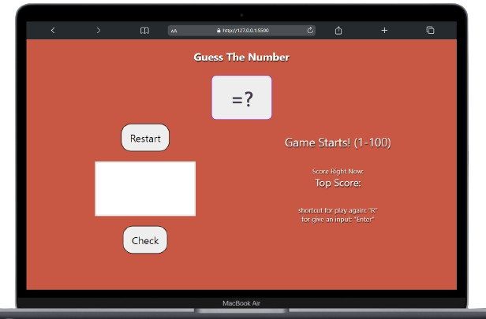
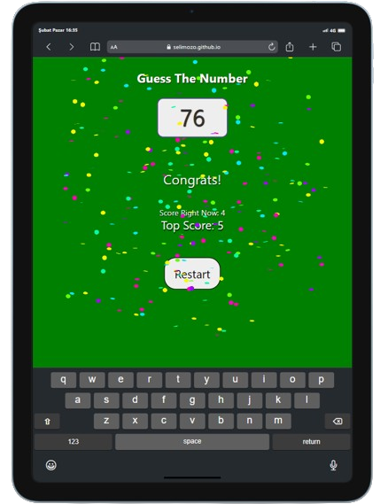
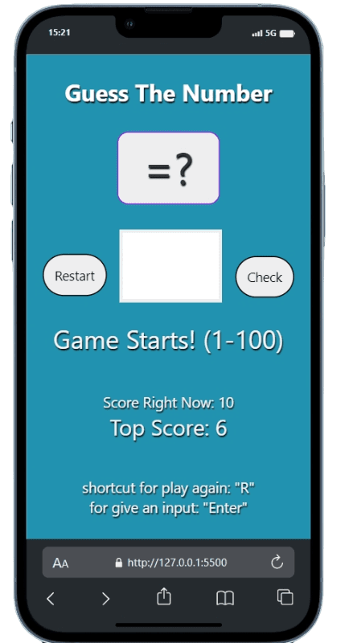

# Guess Number Game (DOM)
:star: star on github > it motivates.   
You should ask yourself two questions:   
<strong>1st one:</strong> How fun can a guessNumber game be?   
<strong>then 2nd one:</strong> What's more fun than playing guessNumber game?
  I added some libraries like confetti-js for much more fun (when you win the game effects appear.) and html sanitizer for a bit more security.
Also when you restart website going to have different background color. I tried to make game much more fun that's all. Hope you enjoy it!
## Start to play
Play now on the website - [guessNumberGame](https://selimozo.github.io/guessNumberDOM/)  
## Responsive

## Contributing
Your contributions are welcome! Before sending a Pull Request, please make sure that you're assigned the task on a GitHub issue.
## License
MIT License.
